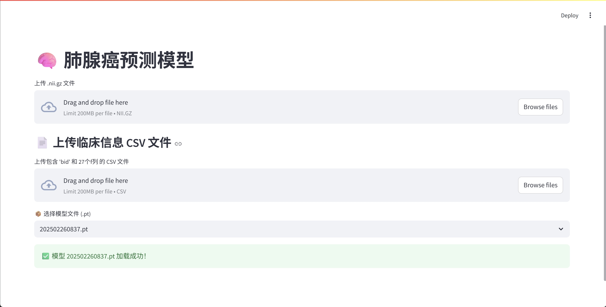

# CM-DAC Streamlit Web

## 🌀 项目概述

本项目提供了一个基于 Streamlit 的互动式网页界面，用于：

* 📎 上传 3D NIfTI 医学图像 (`.nii.gz`)
* 🎮 三角度分层显示原始图像和裁剪区域
* 📌 支持自定义或自动设置图像中心点进行裁剪
* 🔢 集成已训练 PyTorch 模型进行类别预测
* 🌐 上传并添加临床信息实现多模态输入
* 🔗 TRAIN CODES: [LungCancerDC](https://github.com/fancccc/LungCancerDC.git), [CM-DAC](https://github.com/fancccc/CM-DAC.git)
---

## 📊 功能精要

* 上传 `.nii.gz` 图像文件，分规显示轴向、冠状、矩状分层
* 根据中心坐标裁剪出 32x32x32 的图像块
* 上传包含 pid/bid 和 f0\~f26 列的临床 CSV 文件
* 根据 NIfTI 文件名称自动匹配 CSV 中对应行
* 从 `./models/` 中选择已训练的 .pt 模型
* 输出各类别概率和预测结果

---
## 🎬 Demo Video


👉 [点击这里在线播放演示](https://fancccc.github.io/CM-DAC-StreamlitWeb/video.html)

## 📦 项目目录结构

```
.
├── app.py                 # 主流 Streamlit 页面
├── nets.py                # 模型结构定义
├── models/                # 存放已训练模型
├── example_data/          # 示例图像和 CSV 数据
├── requirements.txt       # 项目依赖
└── README.md              # 项目简介
```

---

## 🤖 使用指南

1. 克隆项目：

```bash
git clone https://github.com/yourname/CM-DAC-StreamlitWeb.git
cd CM-DAC-StreamlitWeb
```

2. 安装依赖：

```bash
pip install -r requirements.txt
```

3. 启动 Web App：

```bash
streamlit run app.py
```

4. Web 页面操作：

   * 上传 `.nii.gz` 医学图像
   * 上传匹配的临床 CSV 文件
   * 选择模型并进行预测

---

## 🤝 致谢

* 基于肺腺癌分类研究模型构建
* 使用技术：[Streamlit](https://streamlit.io/), [SimpleITK](https://simpleitk.readthedocs.io/en/master/), PyTorch

---

## 🌍 License

This project is licensed under the MIT License.